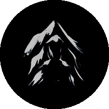

[![Contributors][contributors-shield]][contributors-url] [![Forks][forks-shield]][forks-url] [![Stargazers][stars-shield]][stars-url] [![Issues][issues-shield]][issues-url] 

[![LinkedIn][linkedin-shield]][linkedin-url] [![Patreon][patreon-shield]][patreon-url]

<!-- PROJECT LOGO -->
 

<h3 align="center">Portfolio v2</h3>

An updated version of my portfolio using react, scss, and with much snazzier styling.

<a href="https://github.com/Kurohyou/kurohyou.github.io"><strong>Explore the docs »</strong></a>

<a href="https://kurohyou.github.io">View Demo</a> · <a href="https://github.com/Kurohyou/kurohyou.github.io/issues">Report Bug</a> · <a href="https://github.com/Kurohyou/kurohyou.github.io/issues">Request Feature</a>

<!-- TABLE OF CONTENTS -->

Table of Contents

<ol>
<li>
<a href="#about-the-project">About The Project</a>
<ul>
<li><a href="#built-with">Built With</a></li>
</ul>
</li>
<li><a href="#contact">Contact</a></li>
<li><a href="#acknowledgments">Acknowledgments</a></li>
</ol>

<!-- ABOUT THE PROJECT -->

## About The Project
![Product Name Screen Shot][product-screenshot]

(<a href="#top">back to top</a>)

### Built With
- JS
- React
- SCSS

(<a href="#top">back to top</a>)

<!-- CONTACT -->

## Contact

Scott Casey - [@kurohyoustudios](https://twitter.com/kurohyoustudios)

Project Link: [https://github.com/Kurohyou/kurohyou.github.io](https://github.com/Kurohyou/kurohyou.github.io)

(<a href="#top">back to top</a>)

<!-- ACKNOWLEDGMENTS -->

## Acknowledgments

University of Utah Full Stack Bootcamp

This readme template adapted from the [Best-README-Template](https://github.com/othneildrew/Best-README-Template/blob/master/BLANK_README.md) by [Othneil Drew](https://github.com/othneildrew). Readme generated by [Genme! by Scott Casey](https://github.com/Kurohyou/genme-SC).

(<a href="#top">back to top</a>)

<!-- MARKDOWN LINKS & IMAGES -->
<!-- https://www.markdownguide.org/basic-syntax/#reference-style-links -->

[contributors-shield]: https://img.shields.io/github/contributors/Kurohyou/kurohyou.github.io.svg?style=flat
[contributors-url]: https://github.com/Kurohyou/kurohyou.github.io/graphs/contributors
[forks-shield]: https://img.shields.io/github/forks/Kurohyou/kurohyou.github.io.svg?style=flat
[forks-url]: https://github.com/Kurohyou/kurohyou.github.io/network/members
[stars-shield]: https://img.shields.io/github/stars/Kurohyou/kurohyou.github.io.svg?style=flat
[stars-url]: https://github.com/Kurohyou/kurohyou.github.io/stargazers
[issues-shield]: https://img.shields.io/github/issues/Kurohyou/kurohyou.github.io.svg?style=flat
[issues-url]: https://github.com/Kurohyou/kurohyou.github.io/issues
[linkedin-shield]: https://img.shields.io/badge/-LinkedIn-black.svg?style=flat&logo=linkedin&colorB=555
[linkedin-url]: https://linkedin.com/in/scott-casey-20210398
[patreon-shield]: https://img.shields.io/endpoint.svg?url=https%3A%2F%2Fshieldsio-patreon.vercel.app%2Fapi%3Fusername%3Dkurohyoustudios%26type%3Dpatrons&style=flat
[patreon-url]: https://patreon.com/kurohyoustudios
[product-screenshot]: assets/images/screenshot.png